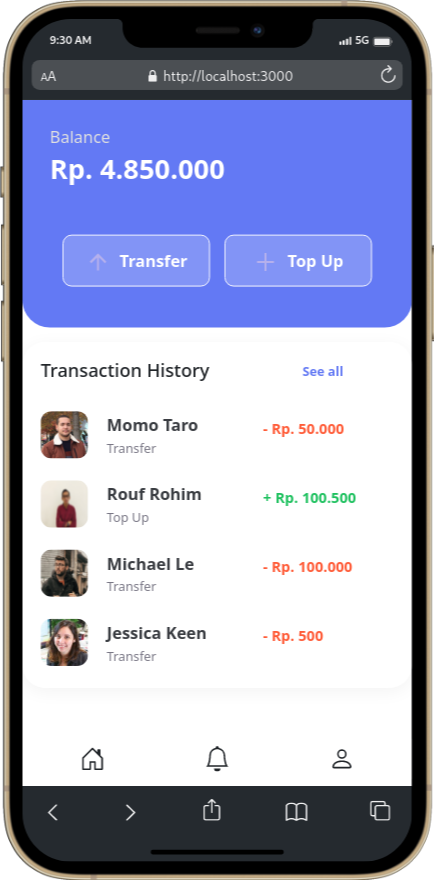

Zwallet adalah sample Dompet digital berbasis Web menggunakan [Next.js](https://nextjs.org/) untuk pengolahan data di frontend menggunakan Redux.

Untuk link repository backendnya [Zwallet-Backend](https://github.com/roufurrohim/zwallet-BE)

Dibawah ini adalah sample screenshoot dari App Coffee Shop tampilan website dan mobile untuk User.

---------------------------------------------------
Tampilan Web|Tampilan Mobile
:-----------------------:|:----------------------------:
|
|
|
|
|
|
|
|